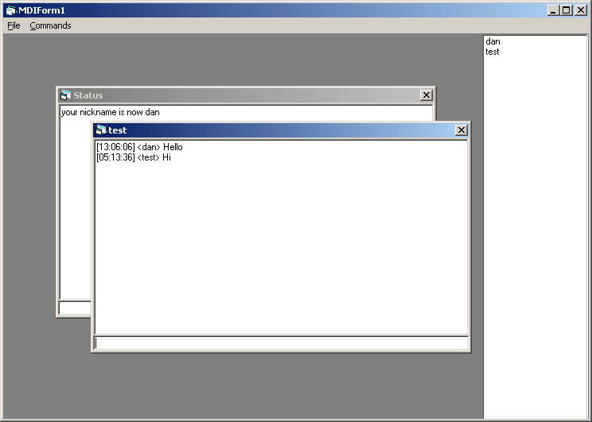



## A cool chat program

### Description

You can comunicate with your friends without using other chat programs.

Also you can choice to comunicate in public or private mode
 
### More Info
 
You have to enter the IP address of the server and a nickname.

             |
---                |---
**Submitted On**   |2003-04-10 23:22:32
**By**             |[onlyeyes](https://github.com/Planet-Source-Code/PSCIndex/blob/master/ByAuthor/onlyeyes.md)
**Level**          |Intermediate
**User Rating**    |4.3 (13 globes from 3 users)
**Compatibility**  |VB 5\.0, VB 6\.0
**Category**       |[Complete Applications](https://github.com/Planet-Source-Code/PSCIndex/blob/master/ByCategory/complete-applications__1-27.md)
**World**          |[Visual Basic](https://github.com/Planet-Source-Code/PSCIndex/blob/master/ByWorld/visual-basic.md)
**Archive File**   |[A\_cool\_cha1589085172003\.zip](https://github.com/Planet-Source-Code/onlyeyes-a-cool-chat-program__1-45553/archive/master.zip)

